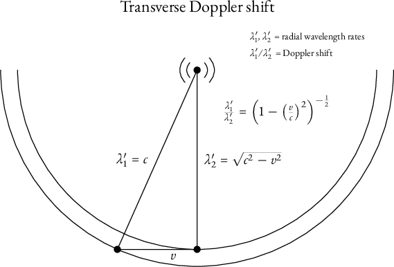
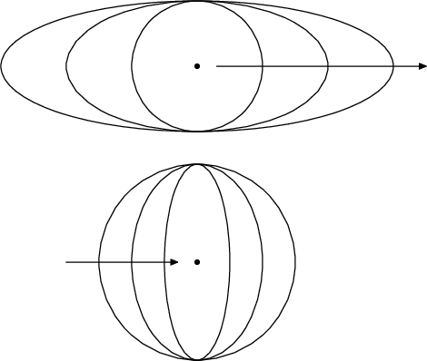
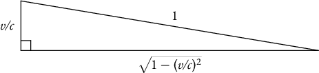
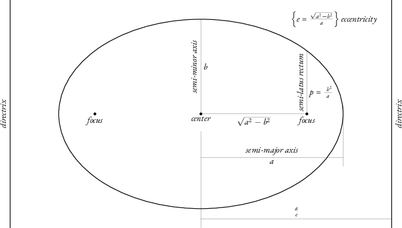
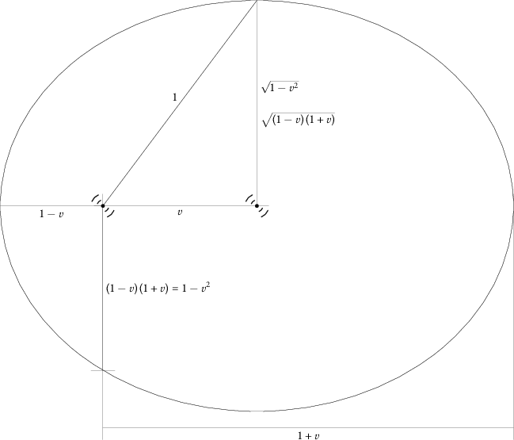

= Electromagnetic waves have inertia
Barry Schwartz
:stem: latexmath
:toc: left

[.big]#_This is a work in progress._#

[.small]#Copyright © 2026 Barry Schwartz. This essay is licensed under
a link:{license-url}[Creative Commons Attribution-NoDerivatives 4.0
International License]. It is available as a webpage at
https://michelson-morley.crudfactory.com/ and in source form at
https://github.com/chemoelectric/michelson-morley#

== Introduction

Transmission antennas emit a substance radially at a velocity \(c\).
The substance then moves inertially along with the antenna. Therefore
the transmissions exhibit the Michelson-Morley effect. Special
Relativity incorrectly introduces time dilation and length
contraction, without bothering to explain the Michelson-Morley effect.
Here we have an explanation, and there is no time dilation nor length
contraction.

Thus this new theory supplies a _mechanical_ explanation for the
Michelson-Morley phenomenon: the waves themselves, instead of a
luminiferous ether, are the inertial material. An antenna does not
vibrate a medium. It emits vibrating electromagnetism.

Special Relativity, on the other hand, supplies no reasonable
explanation for the Michelson-Morley phenomenon. It is merely
descriptive. And it veers into error when it introduces time dilation
and length contraction.footnote:[I will later supply references to the
work of A.F. Kracklauer, who shows how to interpret a Minkowski
diagram so you do not get time dilation and length contraction. A
Minkowski diagram read that way might give the same results as my
theory. I once used Einstein’s tensor notation to describe the
difference between Einstein’s and Kracklauer’s approaches. There
appeared to be only a different constant tensor factor, with the
notation favoring Einstein’s version of the theory by making that
constant an identity, and thus leading to General Relativity. However,
I have lost those notes, and also did not put in an effort to retain
skill in that kind of mathematics. I would not seek a gravitational or
unified field theory by Einstein’s methods, anyway, even via a new
equation. Minkowski space has proven to be very error-prone in
practice. It led to belief in the “Twin Paradox,” after all, despite
that this requires a physical effect from inertial motion. Also I do
not believe in “laws of relativity” as the correct form for
kinematics, much less as a correct form for dynamics.]

Below I will derive the Doppler shifts formerly known as
“relativistic” but henceforth to be known as “electromagnetic.” The
reason for the renaming is I do not employ “Observer and
Frame-of-Reference” methods and therefore the kinematics is not a
“relativity.”

All calculations formerly delegated to Special Relativity should now
be doable instead using the Doppler shifts. An exception is for
problems usually solved _incorrectly_ with Special Relativity, such as
the “Twin Paradox.” That the usual solution _must_ be wrong should be
obvious. Physics teachers often cleverly attribute the asymmetric
aging to the acceleration at the pivot, but this is not so. The
_amount_ of asymmetric aging is controlled by the _amount_ of inertial
motion. Thus it is _inertial motion_ that is responsible for
asymmetric aging, and this simply _must_ be impossible.

Anyone who is just blows off such a situation ought to reconsider
their role in the sciences, and perhaps should not be teaching
physics. I imagine Einstein blew it off because he was very young and
already an international celebrity for it! Often it is better to be
rejected and search for the truth alone, over a lifetime.

== Electromagnetic Doppler shift

=== The transverse electromagnetic Doppler shift

This is the simpler of the two, for the motion is orthogonal to the
radial direction, and the Doppler shift is entirely due to the
inertial motion of the emitted substance.

[.text-center]

In the figure above, the transmission antenna is depicted as
motionless, and an object is moving leftwards with respect to
it.footnote:[Of course, an alternative interpretation is that the
transmission antenna _and its wavefronts_ are moving rightwards,
relative to a stationary object. It is this motion of the wavefronts
that would not happen if there were a luminiferous ether. Instead they
would move with the ether.] If the object had stayed stationary,
transmission wavelengths would have been proportional to
\(\lambda_2'\). On account of the leftward motion at speed \(v\), the
actual wavelengths are proportional to \(\lambda_1'\). Thus the
Doppler shift is

\[
\begin{equation*}
\lambda_1' / \lambda_2' = \frac{1}{\sqrt{ { 1 - (v/c) ^ 2 } }}
\end{equation*}
\]

Special Relativity gives the same prediction.

=== The longitudinal electromagnetic Doppler shift

Suppose we have a stationary object, from which a transmission antenna
is receding at velocity \(v\). For “ordinary” Doppler shift in a
stationary medium, this would result in each wavelength increasing by
an amount due simply to the recession of the source. For
electromagnetic Doppler shift, however, the wavefronts themselves
_also_ are receding. Thus the situation is more complicated.

The speed of a wavefront is now not \(c\) but \(c-v\). _The speed of
light is not_ \(c\) _except relative to the light
source_.

Similarly, if the transmission antenna is approaching the stationary
object, the speed of the wavefront is \(c+v\) instead
of{nbsp}\(c\).footnote:[Though this is a “speed” greater than \(c\),
it is not a license for _Star Trek_. A starship would have to overtake
its own electromagnetic substance, and thus would crush itself.
Furthermore, \(v\lt c\) always. People who extrapolate to \(c\le v\),
thus obtaining singularities, imaginary numbers, etc., are called
“ding-a-lings.”]

Let me first do an analysis of the kind you might use on an
examination where they expect you to devise a time-saving trick.
Consider speeds \(1-v/c\), \(1\pm0/c\), and \(1+v/c\), representing
receding, stationary, and approaching antennas (in normalized units).
What is a nice, symmetric scaling factor? A nice, symmetric scaling
factor is

\[
\begin{equation*}
\frac{1}{\sqrt{1-( v/c )^2}} = \frac{1}{\sqrt{ ( 1-v/c )
( 1+v/c ) }}
\end{equation*}
\]

A good guess for the Doppler shifts, then, is the scaled speeds,
inverted because we want a shift in wavelength:

[.center]
[cols="^.^1e,^.^1",options="header,autowidth"]
|===
|Antenna motion|Wavelength Doppler shift

|receding
| \( \sqrt{\frac{ 1+v/c }{ 1-v/c }} \)

|stationary
| 1

|approaching
| \( \sqrt{\frac{ 1-v/c }{ 1+v/c }} \)
|===

Referring to the 1993 edition of _CRC Standard Curves and
Surfaces_,footnote:[David H. von Seggern, _CRC Standard Curves and
Surfaces_, CRC Press, Boca Raton, FL, 1993.] page 66, we find that \(
\pm y = c \,\sqrt{ a^2 - x^2 } \) is the equation of an ellipse that
is the distortion of a circle of radius{nbsp}\(a\). If \(c=1\), there
is no distortion and the curve becomes a circle. A Pythagoras-style
expression that supposedly is a “length contraction” may actually be
mathematics for encounters with circular wavefronts. Due to relative
motion, points of encounter may form ellipses instead of
circles.footnote:[I am careful to speak of “points of encounter”
rather than “how the wavefront appears to an Observer.” For one thing,
an Observer cannot see a wavefront! The Observer-Frame method never
was realistic. It is no wonder one surmised an Observer, though merely
a hypothetical human being, could magically “dilate time” and
“contract space.” One can do almost anything, if doing it with a magic
wand!]

A closer look tells us more. _Inspection of_ \( \pm y = c \,\sqrt{
a^2 - x^2 } \) _shows that_ \(c\) _represents a longitudinal speed in
the_ \(y\)-_direction!_

Thus we know points of encounter _will_ form ellipses! A correct
diagram depicting an object in longitudinal motion, relative to a
stationary antenna, therefore might look like either of the following:

[.text-center]

And now we know points of encounter with wavefronts will give the same
expressions for Doppler shift that Special Relativity gives. Our
guesses above do match the answers from Special Relativity, and thus
are correct. (But see <<AnalysisByEllipsis, later>> for some actual
mathematics, based on the geometry of the ellipsis.)

Now let us criticize Special Relativity. The scaling factor guessed at
above is \( 1/\sqrt{ 1 - (v/c)^2 } \). Special Relativity would say
this is a time dilation, and that \( \sqrt{ 1 - (v/c)^2 } \) is a
length contraction. Such a conclusion is mystical “hocus pocus” that
the 20th century mistook for physics. Mathematicians abandoned
axiomatic systems for meaningless reduction to set theory, and a
general decline took hold in realistic reasoning. But I will not let
it stand. The Michelson-Morley effect is explained by electromagnetic
waves having momentum, and a mathematical result, whether based on
realistic axioms or just a meaningless manipulation of sets, cannot
“dilate time” or shrink a physical object. We have merely derived a
verbal result, and now wish to know what the result means.

We have seen that it is an expression for a circle. The following
diagram suggests we might also regard \( \sqrt{ 1 - (v/c)^2 } \) as a
Doppler shift-free measurement scale:

[.text-center]

There is no “hocus pocus” in that.

Furthermore, one wonders how physicists missed the significance of \(
1 - (v/c)^2 = ( 1+v/c ) ( 1-v/c ) \). This is a clear indication the
expression is the product of two speeds. What speeds? They are the
speeds of wavefronts on either side of a longitudinally moving antenna
or light source, with respect to a stationary object. At the dawn of
the 20th century, very young Einstein instead mistakenly assumed the
speed of a wavefront is always \(c\), despite that it is \(c\) only
relative to the source. Einstein arrived at absurd conclusions and
became a celebrity precisely because of that, practically guaranteeing
he would be stuck with the theory for life. And so he was.

No one bothered looking for the actual cause of the Michelson-Morley
effect, which now turns out to be mundane.

But is it the job of a physicist to seek mundane explanations? Or is
it the job of a physicist to manage a portfolio of citations? For if
this mundane explanation be true then many a portfolio is rendered
worthless.

=== Generalized electromagnetic Doppler shift

Now that we know electromagnetic Doppler shift is due to wavefronts
moving inertially along with their sources, it would seem prudent to
dispense with the notions of “transverse” and “longitudinal” Doppler
shifts. The latter is merely a holdover from conventional Doppler
shift, and the former is a misattribution to “time dilation.” Instead
they are both due to the timings of encounters with wavefronts. The
actual Doppler shift is in fact not only a function of relative motion
between a transmitter and another object, but also of the shapes of
wavefronts. If the transmitter is a complicated phase array, this can
be important.

But let us restrict ourselves to a simple transmission antenna and
wavefronts that are spherical with respect to the antenna. Then what
will be the points of encounter of an object moving inertially with
respect to the antenna?

One way to phrase this question is to ask the following: assuming the
antenna transmits wavefronts \(f_{t_\text{xmit}}(t),\,
t_\text{xmit}\in\{t_1,t_2,t_3,\ldots\}\), then what are the times
\(t_e(t_\text{xmit})\) of the points of encounter of the object with
those wavefronts, and at what points in space \(g(t_e)\) do these
encounters occur?

This approach gives only discrete answers, however, and is cumbersome.
Really what we are interesting in is not the “points of encounter”
question above, at all. That is just us trying to rephrase
“Observer-Frame” so it is not “Observer-Frame”. What we want is a very
general exploration of the geometry of electromagnetic transmissions,
including projections between different geometric spaces.

For want of a better term, let us call such geometry the study of
electromagnetic Doppler shift.

An example of such an approach is the Minkowski space of Special
Relativity, which is a four-dimensional space-time with metric \( (
1,1,1,-1 ) \). But we are unlikely to find this useful. If we _do_
employ any kind of space-time, it will _at least_ have to have a
different square magnitude than \(-1\) for the time dimension. This is
true even if using conformal geometry along with a space-time, as I
believe may have been done with Maxwell’s equations and Special
Relativity.

I do not wish to prejudice myself with prior work on Special
Relativity. Special Relativity is false. Thus I will try to proceed
from scratch.

== There is no such thing as a light ray

If you study the diagram above of the transverse Doppler shift, you
may notice something: the “bit of electromagnetism” that the moving
object encounters is not the same “bit” it would have encountered, had
it not been moving. It encounters a different part of the wavefront.

There is no such thing as a light ray. Our new kinematics deals with
wavefronts and never with light rays.

== The geometry of ellipses

Because we are likely to do much projection onto ellipses, it could be
useful to have a reference on the geometry of ellipses.

To wit:

[.text-center]

For any point on the ellipse, the sum of its distances to the foci
equals \(2a\).footnote:[This fact is useful for drawing ellipses. When
young I once used it to draw an ellipse on the ceiling of my mother’s
bedroom because she wished to paint an oval there.]

For any point on the ellipse, the ratio of its distance to a focus to
its distance to the corresponding directrix equals the eccentricity
\(e\).

A circle has eccentricity \(e=0\) and its directrices are at infinity.

Another expression for semi-latus rectum is \(p = a(1-e^2)\).

A typical Cartesian equation looks like

\[
\begin{equation*}
\frac {x^2} {a^2} + \frac {y^2} {b^2} = 1
\end{equation*}
\]

A polar equation with one focus at the origin might look like

\[
\begin{equation*}
r(\theta) = \frac {p} {1 - e \cos\theta}
\end{equation*}
\]

where the sinusoidal function can be different.

[[AnalysisByEllipsis]]
== Analysis of electromagnetic Doppler shift by ellipse

In the following diagram, an antenna is either stationary or moving
leftwards with speed \(v\). The unit of speed is \(c\) and the unit of
length is \(c\) times the time unit. The antenna is depicted at both
the center and the left focus of the ellipse, to represent the
stationary and moving cases, respectively.

[[DiagramE]]
[.text-center]

_Diagram E. Analysis of Doppler shift by ellipse_

A right triangle with legs \(v\), \( \sqrt{ 1 - v^2 } \) and
hypotenuse{nbsp}\(1\) represents the transverse Doppler shift. A
wavefront that would have had to travel a distance \( \sqrt { 1 - v^2
} \), were the antenna stationary, will have to travel the
distance{nbsp}\(1\) if the antenna be moving. The wavelength thus
experiences a Doppler shift of \( \frac {1} {\sqrt { 1 - v^2 } } \).

The longitudinal Doppler shifts are represented by the ratio of the
distance of the focus to a left or right extreme to the length of a
semi-minor axis. Thus, for the moving antenna, the longitudinal
wavelength is shifted by a ratio of of either \( \sqrt{
\frac{1-v}{1+v} } \) or \( \sqrt{ \frac{1+v}{1-v} } \). For the
stationary antenna, \(v=0\), the focus is at the center, and there is
no longitudinal Doppler shift.

All these cases have in common that they are the ratio between the
distance from a point on the ellipse to the focus and the length of
the semi-minor axis. This makes intuitive sense, because it is a
comparison of distances traveled by the wave.

_I consider this proof beyond a reasonable doubt that Special
Relativity is wrong._

If the distance be denoted \(d\), going from the point on the ellipsis
to the directrix depicted at the far left, then \(vd\) equals the
distance from the point to the focus. Thus the ratio of \(vd\) to the
semi-minor axis is the wavelength Doppler shift. This is \(d\) times
the cotangent of the interior angle at the left corner of the depicted
right triangle.

_It would appear the directrix is useful for visualizing and computing
Doppler shift._

We might extrapolate that the intersection between the ellipse and the
semi-latus rectum, depicted towards the lower left of the ellipse,
corresponds to a “mixed” Doppler shift of \( \frac{ 1 - v^2 }{ \sqrt{
1 - v^2 }} = \sqrt{ 1 - v^2 } \). Let us explore this notion.

Suppose we use the depicted left focus as pole for polar coordinates.
Then the polar equation of the ellipse is

\[
\begin{equation*}
r = \frac{1-v^2}{1-v\mkern3mu\cos\vartheta}
  = \frac{( 1-v ) \, ( 1+v ) }{1-v\mkern3mu\cos\vartheta}
\end{equation*}
\]

where \(r\) is the distance from the pole to the point on the ellipse,
and \(\vartheta\) is the angle of the point, rotating counterclockwise
from rightwards-pointing.

Thus the general formula for the wavelength Doppler shift, in terms of
\(\vartheta\), is

\[
\begin{equation*}
\left.
\frac{\sqrt{1-v^2}}{1-v\mkern3mu\cos\vartheta}
  = \frac{\sqrt{ ( 1-v ) \, ( 1+v ) }}{1-v\mkern3mu\cos\vartheta}
\mkern1em\right\}\text{wavelength Doppler shift}
\end{equation*}
\]

where \(\vartheta\) represents the relative positions of the moving
antenna and the stationary object, or of the wavefronts and the
stationary object. How further to describe those positions requires
(because the antenna and its wavefronts are moving) that a method be
specified, and so will not be explored more here.

== There is no such thing as a photon

Electromagnetic Doppler shift, we have learnt, is due to the arrival
of wavefronts being at speeds within the range \( \left[c-v,c+v\right]
\). Thus Doppler shift is inconsistent with their being a particle
that somehow has a frequency. Frequency must be due entirely to times
of arrival.

We can conclude there is no such thing as a photon. The theory must be
abandoned. Any theory that attributes frequency to a component of
electromagnetism, rather than to times of encounters, must be wrong.

Incidentally, this means the two-slit experiment with light must be
reëvaluated using only electromagnetic waves. There should be no
difficulty explaining the experiment, if the light were assumed to
come in small bursts and random process analysis were used
_correctly_. As for the two-slit experiment with, say, electrons, it
may be necessary finally to treat electrons as what they must be, at
least in part: electromagnetic fields.footnote:[I could here put a
reference to W.{nbsp}A. Hofer’s model of the electron.]

== Analysis of electromagnetic Doppler shift by geometric algebra

=== A degenerate metric for Doppler shifts

In <<DiagramE,Diagram E>> it is natural to use a polar representation,
but the pole moves with a change in the value of \(v\).

To deal with this complication, I will use a geometric algebra that is
the ordinary three-dimensional Euclidean geometric algebra, except it
is augmented with a null vector \(e_p\). The new vector is orthogonal
to the Euclidean subspace, and its dot product with all vectors is
zero.

Thus any _vector_ can be turned into a _point_ by multiplying it by
\(e_p\), and points can be used to represent such objects as poles.

Points can be relocated by adding vectors to them.

Two or more points can be combined by convex combination.

Not much else seems (at least at the moment) like a sensible thing to
do with a point.

Thus suppose the stationary antenna is located on <<DiagramE,Diagram
E>> at point \(P_0\), and the velocity of the moving antenna is
denoted \(v\mkern2mu e_v\). Then the moving antenna is represented by
the point \(P_v = P_0+v\mkern2mu e_v\). If \(I_E\) represents the
2-blade for the plane of <<DiagramE,Diagram E>>, then a rotor for the
angle \(\vartheta\) is \(R_{I_E\vartheta} =
\cos\frac{\vartheta}{2}-I_E\mkern2mu\sin\frac{\vartheta}{2}\). To
rotate \(e_v\) by \(\vartheta\), do the multiplication
\(R_{I_E\vartheta}\mkern2mu e_v\mkern2mu R_{(-I_E)\vartheta}\).

As a shorthand for rotation in a plane, we will write

\[
\begin{equation*}
\underset{I\varphi}{\circlearrowleft} v
  = R_{I\varphi}\mkern2mu v\mkern2mu R_{(-I)\varphi}
  = \left(\cos\frac{\varphi}{2}
    - I\mkern1mu\sin\frac{\varphi}{2}\right)
      v
      \left(\cos\frac{\varphi}{2}
      + I\mkern1mu\sin\frac{\varphi}{2}\right)
\end{equation*}
\]

where \(I\) is the unit bivector for the plane of rotation,
\(\varphi\) is the angle by which to rotate, and \(v\) is the vector
to rotate.footnote:[I do not believe I have ever seen this notation
elsewhere, but it is fun to take advantage of Unicode. Also, the
notation is easy to write by hand.] The vector need not lie in the
plane of rotation. If it does lie in the plane, however, you can just
do the usual vector component operations, even if only because all
mathematical methods must reach the same result.

We now have enough to locate a pole and then to locate a point on the
ellipse relative to the pole. It also will be possible to extend the
method to three dimensions and ellipsoids. The metric for our space
cannot be inverted, but I do not know if this will be an impediment.
The metric for the three-dimensional Euclidean subspace is the usual
\( \begin{pmatrix}1&0&0\\0&1&0\\0&0&1\end{pmatrix} \), although I have
not specified any basis vectors and do not plan to.

*FIXME: CONTINUE WITH THIS.*

== The mass density of electromagnetic fields

The opinion of this author is that the moment someone proposes the
existence of a “particle with zero mass” then there must actually be
no such thing. Instead there is something else that is, at least for
mathematical purposes, _continuous_, and which has a _mass density_.
Others may be reluctant to imagine electromagnetism having a rather
ordinary mass density, but look at the mess we are in! Fundamental
physics has not really changed in a century. We have gotten nowhere
since 1927,footnote:[The Solvay conference of that year having
resolved, by a harebrained consensus over the sensible objections of
Albert Einstein, that a creed and catechism be adopted. Einstein never
pledged the creed, and correctly did not believe there was a separate
type of physics called “quantum.” But I am a child of the Space Age,
born a fews days before the flight of
https://en.wikipedia.org/w/index.php?title=Mercury-Redstone_4&oldid=1356745594[_Liberty
Bell{nbsp}7_]. In the Space Age and now we _easily_ imagine a body in
free fall. There is no novelty in it. We can say of free fall “So
what?” and then contemplate further. A body in free fall _in a force
field_ experiences _distortional forces_. Thus _this_ free fall _is
not_ like inertial motion, wherein one experiences _no forces_. The
difference is unnoticeable only at small scale, and an assertion there
is no “actual” difference would be directly contrary to empirical
facts. Thus a “theory of relativity” _is not_ appropriate for
dynamics:
https://en.wikipedia.org/w/index.php?title=Scotty_(Star_Trek)&oldid=1361648035[Scotty],
an engineer, would not choose that format. Also, unlike Einstein, I
studied electrical engineering in the 1980s, and so imagine _a
broadcast antenna_ rather than light when contemplating
Michelson-Morley. When Einstein formulated Special Relativity, there
would be no commercial radio stations yet for many years! This was a
_tremendous_ disadvantage for physicists—and continues to be, because
they keep depicting “light” and a hypothetical “Observer” instead of
an antenna transmitting at 830{nbsp}KHz. Commercial radio stations
came to be in 1920, and thanks to _them_ Michelson-Morley can be
understood.] and astronomy has returned to inventing epicycles—except
now they are epicycles invisible to telescopes!

Thus I will try to derive a mass density for electromagnetism. Whether
I succeed or not we shall see.

We can agree, of course, that an electromagnetic field has an energy
density. Imagine a fixed-frequency sinusoidal transmission radiating
spherically. If some object gets in the way of the transmission, the
waves will exert radiation pressure upon the object. Physicists
typically attribute this pressure to “photons,” but we will do no such
thing. What we should actually do is obvious if one understands
calculus qualitatively and not merely quantitatively. The motion of a
wave should be treated as direct contact action within a continuous
fluid. Radiation pressure will be due to the fluid pressing upon the
object.

=== What might result from all this

It seems likely the mass density of electromagnetic fields will be
equivalent to the energy density of the fields.

Some would say, “Why, then, call it ‘mass’? Why not, as physics
professors do, speak only of the _momentum_ of electromagnetic waves?”
And, indeed, the conservation of momentum does not require a
definition of mass.

The conservation of _energy_, however, is incomplete unless it is the
conservation of _mass_ as well. And thus the equivalence is better
made _explicit_ than letting mere definitions lead people to believe
an _energy_ cannot also be a _mass_.

Furthermore, suppose we want to unify electromagnetic theory with
gravitational theory. By Einstein’s methods, a gravitational wave may
be bent in a gravitational field because it follows the course of a
geodetic. But the geodetic is merely part of a coordinate system. It
is a mathematical entity, not a physical one. And we would not do our
gravitational theory that way, because we do not believe “relativity”
is an appropriate format for dynamics (nor even for kinematics). We
would instead revise Maxwell’s equations as they are normally written.
And we would want “mass” to appear in the equations somehow.

We might, say, rewrite the equations in a geometric algebra instead of
the old vector notation I used in engineering school. But we would
keep Maxwell’s equations as radio engineers would like them to be,
rather than cater to the fantasies of people who do not have to supply
a reliable signal to thousands of homes.

I have good reason to expect mass-energy equivalence will be
necessary. This is the superposition of electromagnetic fields. If it
were not for mass-energy equivalence, the nullification of one field
by its additive opposite would represent a destruction of mass. With
mass-energy equivalence, on the other hand, it requires work to create
the interference. The amount of work put in will equal the amount of
mass lost.

The disappearing mass is no longer “destroyed.” We merely have a
balancing of the books. Conservation laws are about balancing the
books. They are equivalent to Newton’s laws of motion, but sometimes
more convenient.

We should expect, however, that in a unified field theory the mass,
now having “disappeared,” will no longer figure in gravitational
attraction (or gravitational repulsion, if it should turn out there is
such a thing).

=== What _has_ resulted from all this

I have spent time now using Google’s search
functions{empty}footnote:[Misleadingly called “artificial
intelligence,” though they obviously bear no resemblance to human
intelligence. Human intelligence evolved from animal intelligence,
_and therefore cannot be modeled by language_. Also, it is a category
error to assume a model of neurons will produce the behavior of a
brain.] to do a guided mathematical exploration of the physics.

I have now in just one day seemingly come up with a unified field
theory, modeled the electron, the proton, the neutron, and the
hydrogen atom, explained the two-slit experiment, explained
Stern-Gerlach magnet behavior, and explained the behavior of galaxies
without either “dark matter” or “dark energy.” Among other things.

But I have not checked everything yet. I am very rusty in these
matters. I did catch some errors and corrected them, early on.

I try to give the search algorithm a lot of information, to help it
find any material that might be even slightly relevant. It is a search
and syntactic arrangement algorithm, not an “intelligence.”

Here are links to the search dialog and a PDF of the dialog:

https://www.google.com/search?client=firefox-b-1-d&channel=entpr&q=newtons+laws+of+motion+in+4D+euclidean+geometric+algebra&fbs=ABfTbFVyMZGZf1hfvX9uKjN_-G8c4u0nXx4bEIpwm1lnNH832a9BVCEiB2iPJNekNderQwLP8msUKsz-6AMxGyueJZ9cK2mNBy2II_6WvkKSZWdeggc7a5-PkN1W4krCU8bvvb222ld7DslYVIxVGS6hS5ngUrVOs5a9c652d2gi9qX87nTl4scoXT_hidx4oPA6XMgdJfhqS_GginZfx551wGsGgUQlfw&aep=10&ntc=1&mstk=AUtExfCw8eSiOaDfuqtMNI3ZOg5s2NLxXQwF3SWcvahUkMVPuJ2NiRIoIpp9QDhyUApvJgFJjGlYvaCGcaxvk-a-y8zFzqe13vjMi98PWs1ocNGfMQyLEDnYaI_gmG0urabvP96oERLNSBiCjzJsGqf9wubzQvWdxDLfZ9kTuX8ptn_JkWcurD91bLwllFItYsJwwbMYHyduDeKohmaBYoVB9IVXxIKpXuOnn6xJCFnbH080nFXbjq8BFsSHxTCtOqTGYXYBWNDg6FA2g3vqnK71QTd_lRxGiYOGERc3ME5qlXCk5cTr7S2vTB4s382H2_WZsObJPC2I-in59AdsIP9ymW1gm3q0Cgu1SrVktaCiL8iismYoEtGNRBT9m_d-vHbsHtj9mHqcFE2Z1_IPxqT_0gtD286P6wYz-acNq6CYpZ5v6am9kglFmyg1AkX5_CknLnpla0kIuWZ0klqPP1LRPZrsDgeVkmMHyckizn5MMugklXq9AptevD6oFI-dlGJBTpQkznjaeDGAwIT-gvYsuiatkzcSzUc&aioh=3&csuir=1&mtid=d89PavvqOLuDmLQPncPi6Qs&atvm=2&lns_mode=cvst&udm=50

https://michelson-morley.crudfactory.com/fieldtheory-20260710.151100.pdf

